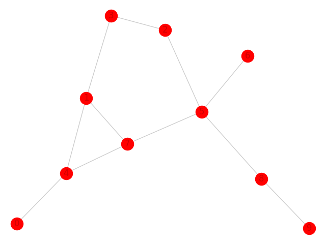
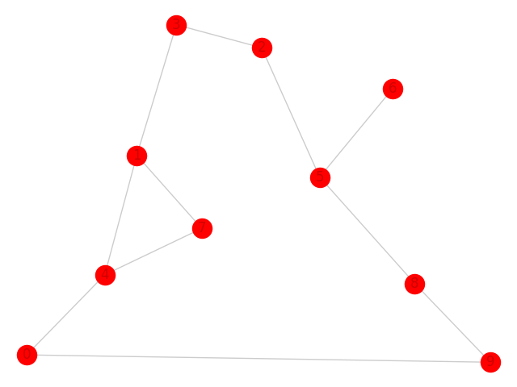
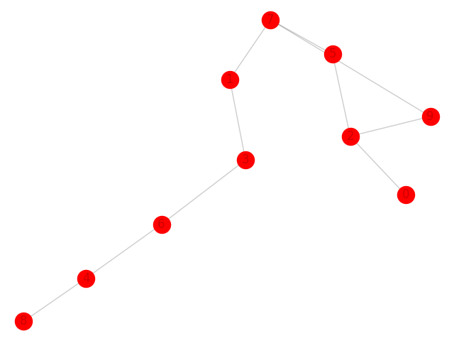

# Graph_Match_Network
This is the reference implementation of graph match network

The data generator is used to generate graphs in graph edit distance classification problem.

This is an example of the generated graphs.

anchor graph

positive graph:edit distance=1

negative graph:edit distance=2

